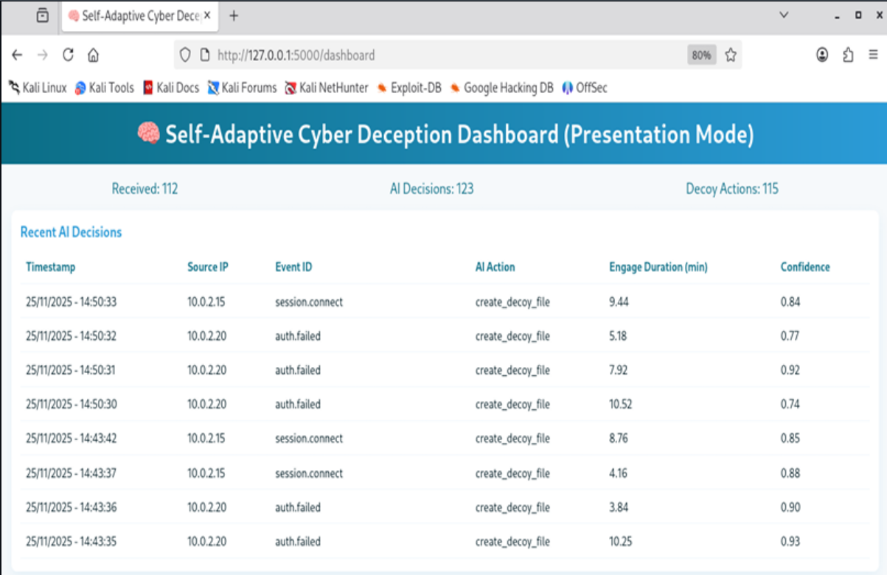
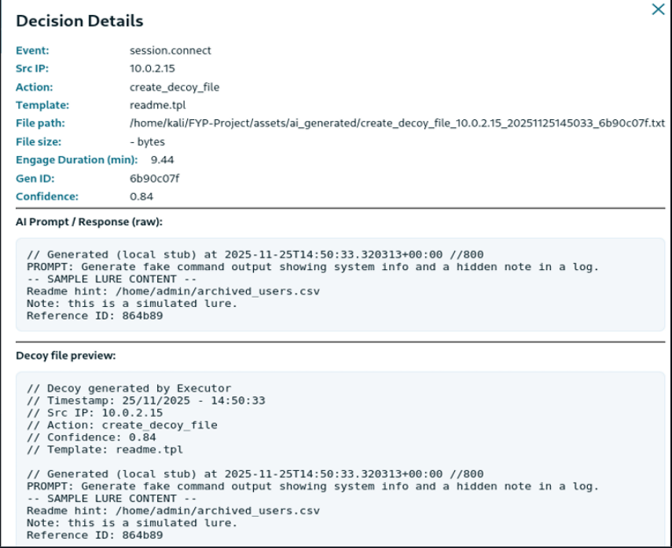
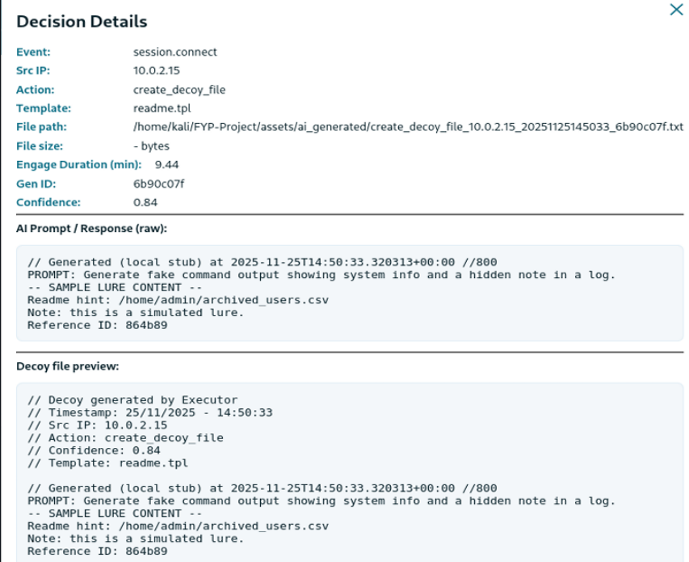

# 🛡️ Self-Adaptive Cyber Deception System - AI-Driven Honeypot & Real-Time Deception


---

## 📌 Project Overview
- This project presents a fully automated, self-adaptive cyber deception system that integrates a medium-interaction honeypot with an AI-driven decision engine to respond to real attacker intrusions in real time.  

- Unlike static honeypots, this system analyses each attacker event individually and generates a unique, dynamic deception artifact in response - no two decoy outputs are identical. The AI engine selects from multiple deception strategies based on event type, assigns a confidence score, and triggers the executor to deploy the appropriate decoy.  

- The architecture mirrors real-world SOC and blue-team workflows - providing continuous attacker monitoring, automated deception execution, and full pipeline visibility through a real-time dashboard. The system was stress-tested with 50+ events and maintained 100% event capture success with an average AI decision latency of 120ms.  

---

## 🎯 Objectives
- Deploy a Cowrie medium-interaction SSH/Telnet honeypot to capture real attacker events in real time  
- Build a Flask-based webhook to receive, validate, timestamp, and store incoming attacker events  
- Develop a lightweight AI decision engine to analyse each event and select an appropriate deception action with a confidence score  
- Implement a deception executor that generates dynamic, unique decoy artifacts for every attacker interaction  
- Build a real-time monitoring dashboard to visualise events, AI decisions, and generated decoys  
- Evaluate system performance across adaptability, decoy realism, response latency, and resource efficiency  
- Demonstrate practical SOC-relevant skills: threat detection, automated response, deception intelligence, and dashboard monitoring  

---

## 🖥️ System Architecture & Pipeline
**Pipeline:** Cowrie Honeypot → Flask Webhook → AI Decision Engine → Deception Executor → Dashboard  

| Component            | Role |
|----------------------|------|
| **Cowrie Honeypot (Docker)** | Captures SSH/Telnet attacker events - login attempts, commands, session activity |
| **Flask Webhook**    | Receives, timestamps, validates, and stores incoming events - triggers AI engine via subprocess |
| **AI Decision Engine** | Analyses each event, selects deception action, assigns confidence score and variation metadata |
| **Deception Executor** | Generates unique dynamic decoy files with embedded lure hints, timestamps, and action metadata |
| **Flask Dashboard**  | Real-time display of received events, AI decisions, confidence scores, and decoy previews |

---

## 🤖 AI Decision Engine - How It Works
The AI decision engine processes every incoming attacker event individually and produces a structured decision containing:

- Selected deception action - `create_decoy_file`, `insert_fake_credentials`, or `log_only`  
- Confidence score - ranging from 0.72 to 0.96 per event  
- Variation tag - unique identifier ensuring no two decoys are identical  
- Lure hint - embedded fake file path to redirect attacker exploration away from real assets (e.g. `/home/admin/archived_users.csv`, `admin.conf.bak`, `ssh_known_hosts.tmp`)  
- Engage duration - randomised attacker engagement window between 1 and 15 minutes  
- Template selection - determines decoy content structure and format  

Every decision is logged to **ai_decisions.jsonl** and every executed action is logged to **decoy_actions.jsonl** - maintaining full pipeline traceability.  

---

## 🗂️ MITRE ATT&CK Mapping

| Technique ID | Technique Name              | System Response |
|--------------|-----------------------------|-----------------|
| **T1110**    | Brute Force                 | Cowrie captures SSH login attempts - AI triggers decoy deployment |
| **T1078**    | Valid Accounts              | Successful session connections trigger create_decoy_file actions |
| **T1056**    | Input Capture               | Command execution events captured and classified for deception response |
| **T1083**    | File and Directory Discovery | Lure hints direct attackers toward fake file paths and decoy directories |

---

## 📊 Performance Results

| Test Scenario | Events | Decision Latency (ms) | Decoy Files Generated | Capture Success |
|---------------|--------|-----------------------|-----------------------|-----------------|
| Single Event  | 1      | 120                   | 1                     | 100% |
| Small Batch   | 10     | 115                   | 10                    | 100% |
| Medium Batch  | 30     | 125                   | 30                    | 100% |
| Stress Test   | 50+    | 130                   | 50+                   | 100% |

**Live dashboard metrics recorded during testing:**
- Total events received: 112  
- Total AI decisions generated: 123  
- Total decoy actions executed: 115  
- Average decision latency: 120ms  
- Zero dropped events across all test scenarios  
- Zero file system failures during stress testing  

---

## 📸 Screenshots & Observations

### 1️⃣ Main Dashboard - Real-Time Event Monitoring
  
**Observation:** Live dashboard displaying 112 received events, 123 AI decisions, and 115 decoy actions. The Recent AI Decisions table shows attacker source IPs, event types (`auth.failed`, `session.connect`), AI-selected actions (`create_decoy_file`), engage durations, and confidence scores per event - all updating in real time. This interface directly mirrors the monitoring capability of a SOC analyst console.  

---

### 2️⃣ AI Decision Detail — Event Inspector (Decision 1)
  
**Observation:** Detailed decision view for a `session.connect` event from source IP `10.0.2.15`. AI selected `create_decoy_file` action with confidence score **0.84** and engage duration **9.44 minutes**. The decoy file preview shows embedded lure content - a fake README hinting at `/home/admin/archived_users.csv` - designed to redirect the attacker toward a controlled fake file path instead of real system assets.  

---

### 3️⃣ AI Decision Detail - Consecutive Decision Variation (Decision 2)
  
**Observation:** Second decision for a different attacker interaction showing confidence score **0.92** with a distinct prompt - directing attacker toward `/home/admin/admin.conf.bak`. Comparing Decision 1 and Decision 2 confirms the system produces unique, non-repetitive decoy outputs for every event - validating the adaptive deception capability rather than static templated responses.  

---

### 4️⃣ Decoy Artifact Verification - Generated Files Directory
**Image:** Show Image  
**Observation:** The `assets/ai_generated/` directory showing multiple dynamically named decoy files - each uniquely named using action type, source IP, timestamp, and generation ID (e.g. `create_decoy_file_10.0.2.15_20251125141930_8eb6f402.txt`). File sizes ranging from 429–452 bytes confirm each file contains unique content rather than identical copies - validating end-to-end dynamic deception execution.  

---

## 🛠️ Technologies Used

| Technology | Purpose |
|------------|---------|
| **Python 3.x** | AI decision engine, executor, webhook, dashboard logic |
| **Flask** | Webhook API endpoint and real-time dashboard interface |
| **Docker & Docker Compose** | Containerised Cowrie honeypot deployment |
| **Cowrie** | Medium-interaction SSH/Telnet honeypot for attacker event capture |
| **JSON / JSONL logging** | Structured pipeline logging across all components |
| **Kali Linux (VM)** | Primary development and testing environment |

---

## 📁 Project Structure

```plaintext
FYP-Project/
├── code/
│   ├── webhook/              # Flask webhook receiving Cowrie events
│   ├── ai_module/            # AI decision engine and executor
│   │   ├── logs/
│   │   │   ├── ai_decisions.jsonl
│   │   │   └── decoy_actions.jsonl
│   │   └── inputs/
│   │       └── incoming_event.json
│   └── dashboard/            # Flask real-time monitoring dashboard
├── assets/
│   └── ai_generated/         # Dynamically generated decoy artifact files
├── received_logs.json        # All received honeypot events
├── RUN.md                    # Step-by-step deployment instructions
└── README.md
```
---

## ▶️ How to Run
- See **RUN.md** for full step-by-step deployment instructions.  
- The setup deploys a complete automated deception pipeline - Cowrie honeypot captures attacker events, the AI engine processes them in real time, decoys are generated automatically, and the dashboard provides live monitoring of all activity.  

---

## 🔍 SOC & Blue Team Relevance
- Continuous attacker monitoring aligned to SOC alert triage workflows  
- Automated deception responses reducing manual analyst intervention  
- Actionable threat intelligence from real attacker behaviour patterns  
- Full pipeline traceability through structured JSONL logging  
- Dashboard visibility mirroring real SOC monitoring interfaces  
- MITRE ATT&CK aligned detection and response classification  

---

## 🔒 Ethical Notice
- This system is designed exclusively for defensive security research and academic demonstration.  
- All attacker interactions occur within a controlled, isolated virtual environment.  
- No offensive actions are performed.  
- The system was developed and tested in a closed lab environment at the Islamia University of Bahawalpur.  

---

## 🚀 Future Enhancements
- Cloud-based generative AI integration for richer, more contextual decoy content  
- SIEM integration to forward deception alerts into SOC workflows (Splunk, Sentinel)  
- SOAR playbook development for fully automated incident response triggering  
- Multi-node deployment with intelligence sharing across distributed honeypots  
- Reinforcement learning module to refine deception strategies based on observed attacker patterns  

---

## 👤 Author
- Shaheen Bakhsh - Cybersecurity Analyst
- Final Year Project - BS Cybersecurity
Islamia University of Bahawalpur, Pakistan | Supervised by Dr. Arif Mehmood | 2022–2026

